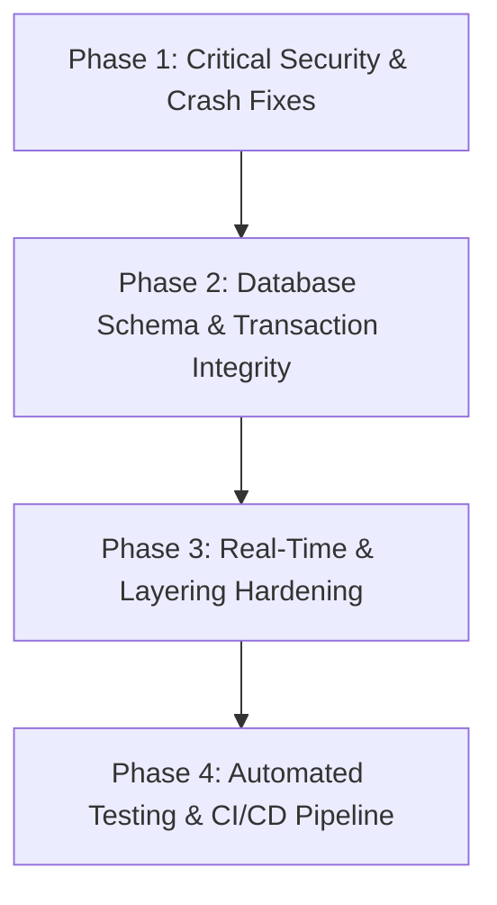

# 🔍 ChefCraft (Tastebuds) — Code Audit & Future Remediation Roadmap

> **Audit Date:** September 2026  
> **Status:** ⚠️ `Requires Hardening` (Critical fixes pending before production readiness)  
> **Target Branch:** `prd`  
> **Scope:** Full-Stack Architecture, Security, Persistence, Real-Time Networking, AI Integration, Frontend Performance & CI/CD  

---

## 📌 Table of Contents
1. [Executive Summary](#-executive-summary)
2. [Dimension Scorecard](#-dimension-scorecard)
3. [Catalog of Errors & Vulnerabilities](#-catalog-of-errors--vulnerabilities)
   - [🔴 P0: Critical Blockers (Security & Crashing Bugs)](#-p0-critical-blockers-security--crashing-bugs)
   - [🟡 P1: High-Priority Issues (Schema Drift & Architectural Debt)](#-p1-high-priority-issues-schema-drift--architectural-debt)
   - [🟢 P2: Medium/Low Priority (UX, DX & Code Polish)](#-p2-mediumlow-priority-ux-dx--code-polish)
4. [Step-by-Step Remediation Roadmap](#-step-by-step-remediation-roadmap)
5. [Future Progress Tracker](#-future-progress-tracker)

---

## 📋 Executive Summary

A comprehensive architectural and security audit was conducted on the **ChefCraft (Tastebuds)** repository. The project demonstrates strong conceptual ambition with rich features: AI-assisted recipe generation with Groq (`llama-3.3-70b-versatile`), automated pantry management, meal planning, real-time messaging, social interaction, and a community marketplace.

However, several critical vulnerabilities and bugs were discovered that make the system unsafe for production without prior hardening:
1. **SQL Injection Vulnerability** via unsanitized query parameters in the recipe filtering endpoint.
2. **Wildcard CORS with Credentials** permitting any `*.vercel.app` origin to execute credentialed requests.
3. **Price Tampering & Non-Transactional Purchases** in the marketplace module allowing arbitrary buyer pricing and concurrent double-selling.
4. **Guaranteed Runtime Crash** in the user password modification routine due to missing password field selection.
5. **Real-Time Spoofing** via unvalidated Socket.io client event handlers.

This document serves as the official issue catalog and engineering roadmap for resolving these defects.

---

## 📊 Dimension Scorecard

| # | Audit Dimension | Score (/10) | Status | Key Highlights |
| :-: | :--- | :---: | :---: | :--- |
| **1** | Architecture & Project Structure | **5.5** | ⚠️ Needs Work | Clean layering in core modules, but completely bypassed in Marketplace controllers; schema drift across SQL files. |
| **2** | Code Quality & Maintainability | **5.0** | ⚠️ Needs Work | Fatal runtime crash in password change routine; inconsistent error handling across modules; ghost client socket handlers. |
| **3** | Security & Authentication | **3.0** | 🚨 Critical | Direct SQL injection vector, wildcard CORS with credentials, JWT stored in `localStorage`, unverified client-side marketplace pricing. |
| **4** | Database & Persistence Design | **4.5** | ⚠️ Needs Work | Lack of transactions on multi-step mutations; schema drift between `schema.sql`, `initDB()`, and migrations; N+1 loop queries. |
| **5** | Real-Time & Socket Architecture | **4.0** | ⚠️ Needs Work | Socket.io accepts unauthenticated guests without rejection; spoofable notification events; in-memory adapter prevents horizontal scaling. |
| **6** | AI Integration & External APIs | **6.0** | 🟡 Moderate | Robust retry/timeout with `AbortController`, but prompt injection vulnerabilities present via unescaped string interpolation. |
| **7** | Frontend UX, State & Performance | **6.5** | 🟡 Moderate | Excellent route-based code splitting with `React.lazy`, but over-fetching waterfalls on dashboard and missing accessibility (a11y) attributes. |
| **8** | Testability & Production Readiness | **2.5** | 🚨 Critical | Zero automated tests (unit/integration/E2E), missing `Dockerfile` / `docker-compose`, unconfigured reverse proxy trust. |

**Overall Score:** `45 / 100`  
**Grade:** `F+`  
**Current Verdict:** `[Requires Hardening]`

---

## 🚨 Catalog of Errors & Vulnerabilities

### 🔴 P0: Critical Blockers (Security & Crashing Bugs)

#### 1. SQL Injection via Query Parameter Interpolation
- **File:** `backend/models/Recipe.js` (Lines 180–182) & `backend/controllers/recipeController.js` (Line 274)
- **Problem:** `filters.sort_by` is taken directly from the query string without sanitization or whitelisting and concatenated into the query:
  ```javascript
  const sortBy = filters.sort_by || 'created_at';
  const sortOrder = filters.sort_order === 'asc' ? 'ASC' : 'DESC';
  query += ` ORDER BY ${sortBy} ${sortOrder}`;
  ```
- **Risk:** Allows attackers to inject subqueries and extract arbitrary data from the database.
- **Future Action:** Validate against an allowed set of columns: `['created_at', 'name', 'cook_time', 'prep_time']`.

---

#### 2. Permissive Wildcard CORS with Credentials
- **File:** `backend/server.js` (Lines 69–72, 84–86)
- **Problem:**
  ```javascript
  if (origin.endsWith('.vercel.app')) {
    return true;
  }
  ```
  With `credentials: true`, any site hosted on Vercel or ending in `vercel.app` can make authenticated requests using the victim's session cookies. Additionally, line 84 passes an `Error` object to the CORS callback, which causes Express to throw an unhandled 500 error instead of cleanly rejecting the request.
- **Risk:** Cross-site session hijacking and data exfiltration.
- **Future Action:** Remove the dynamic `.endsWith('.vercel.app')` check; strictly allow only explicit origins from environment variables (`ALLOWED_ORIGINS`). Call `callback(null, false)` on unauthorized origins.

---

#### 3. Client Price Tampering & Race Condition in Purchases
- **File:** `backend/controllers/marketplace/purchaseController.js` (Lines 5–20)
- **Problem:**
  - `createPurchase` inserts `price` and `seller_id` taken directly from `req.body` without verifying against `marketplace_listings`.
  - The listing update and purchase insertion are performed in separate queries without a database transaction (`BEGIN ... COMMIT`).
- **Risk:** Buyers can purchase any listing for `$0.01`, and concurrent buyers can purchase the same listing simultaneously.
- **Future Action:** Wrap the purchase flow in a database transaction with `SELECT ... FOR UPDATE`, verify `status === 'active'`, use the authentic server-side price, and mark the listing as `sold` atomically.

---

#### 4. Guaranteed Runtime Crash on Password Change
- **File:** `backend/controllers/userController.js` (Lines 51–53) & `backend/models/User.js` (Lines 33–39)
- **Problem:** `userController.changePassword` calls `User.findById(userId)` followed by `User.verifyPassword(currentPassword, user.password)`. However, `User.findById` queries only `id, email, name, avatar_url, created_at`—omitting `password`. Therefore, `user.password` is `undefined`, and `bcrypt.compare` throws an unhandled error every time.
- **Risk:** Complete inability for any user to change their password via the API.
- **Future Action:** Implement `User.findWithPasswordById(id)` to retrieve the password hash for authentication routines.

---

#### 5. Unauthenticated Real-Time Event Injection & Spoofing
- **File:** `backend/sockets/socialSocket.js` (Lines 12–48, 78–82)
- **Problem:** Socket authentication middleware calls `next()` unconditionally, allowing unauthenticated guests to connect. Furthermore, the server listens for `notification:send` from clients and broadcasts it to target users without verification:
  ```javascript
  socket.on('notification:send', (data) => {
    if (data.userId) {
      io.to(`user:${data.userId}:notifications`).emit('notification:new', data);
    }
  });
  ```
- **Risk:** Any client can forge notifications to any user on the platform.
- **Future Action:** Disconnect unauthenticated sockets (`next(new Error('Unauthorized'))`), and delete client-side notification triggers; all notifications must originate from backend controller mutations.

---

### 🟡 P1: High-Priority Issues (Schema Drift & Architectural Debt)

#### 1. Database Schema Discrepancies & Broken Migration Path
- **Files:** `backend/config/schema.sql`, `backend/config/db.js` (Lines 106–234), `backend/migrate.js`, `backend/config/migrations/`
- **Problem:**
  - `schema.sql` defines `measurement_unit`, while `UserPreference.js` queries `measurement_system`.
  - `schema.sql` defines `meal_data` (typo) alongside `meal_date`.
  - `schema.sql` lacks `recipe_ids`, `participant_count`, and `created_by` in `challenges`, which `Challenge.js` expects.
  - `migrate.js` only executes `schema.sql` and ignores all files in `backend/config/migrations/`.
- **Future Action:** Unify the schema, fix column typos, and implement a tracked migrations system (`schema_migrations` table).

---

#### 2. Missing IDOR Guards & Layering Breach in Marketplace
- **Files:** `backend/controllers/marketplace/wishlistController.js` (Lines 36–72), `listingController.js`
- **Problem:** Marketplace controllers execute inline SQL instead of using dedicated models. `getWishlistItems` and `addWishlistItem` do not verify wishlist ownership or visibility, allowing unauthorized users to inspect and tamper with private wishlists.
- **Future Action:** Extract `Listing`, `Wishlist`, and `Purchase` models and enforce user ownership validation before data access.

---

#### 3. LLM Prompt Injection via Unsanitized User Inputs
- **File:** `backend/utils/gemini.js` (Lines 179–199)
- **Problem:** User inputs (`cuisine`, `ingredients`, `dietaryRestrictions`, `pantryItems`) are directly interpolated into the Groq LLM prompt string without sanitization or XML delimiter wrapping.
- **Future Action:** Sanitize input strings, enforce length limits, and wrap user inputs in structured tags (e.g., `<ingredients>...</ingredients>`).

---

#### 4. Blocking `KEYS` Command in Redis Cache Service
- **File:** `backend/services/cacheService.js` (Lines 73, 104)
- **Problem:** Invalidation calls execute `redisClient.keys('feed:*')`. The `KEYS` command is $O(N)$ and blocks the single-threaded Redis event loop.
- **Future Action:** Replace `KEYS` with `SCAN` or adopt key versioning.

---

#### 5. Unconfigured Reverse Proxy Trust
- **Files:** `backend/server.js` (Line 43), `backend/middleware/rateLimiter.js` (Line 97)
- **Problem:** Express does not enable `trust proxy`. When deployed behind cloud load balancers (Render, Vercel), all client requests appear to originate from the proxy's IP address, causing rate limits to throttle all users simultaneously.
- **Future Action:** Add `app.set('trust proxy', 1);` before mounting rate limiters.

---

#### 6. Missing Request Body Validation
- **Files:** `backend/routes/recipe.js`, `backend/routes/pantry.js`, `backend/routes/marketplace/`
- **Problem:** Validation middleware is only attached to auth and post routes. Over 80% of routes lack request payload validation.
- **Future Action:** Attach `express-validator` schemas to all write routes.

---

### 🟢 P2: Medium/Low Priority (UX, DX & Code Polish)

#### 1. Automatic Re-seeding of Deleted Recipes
- **File:** `backend/controllers/recipeController.js` (Lines 116–134, 280)
- **Problem:** `getAllRecipes` calls `ensureDefaultRecipesForUser`. If a user deletes all their recipes, the system automatically recreates the 4 default recipes on the next fetch.
- **Future Action:** Seed recipes only once during account creation in `authController.register`.

---

#### 2. Dual JWT Storage in `localStorage`
- **Files:** `frontend/src/context/AuthContext.jsx` (Lines 29, 57, 80), `frontend/src/services/api.js` (Line 31)
- **Problem:** Tokens are stored in browser `localStorage`, making them vulnerable to exfiltration if an XSS vulnerability occurs.
- **Future Action:** Rely exclusively on `httpOnly`, `SameSite=Strict` cookies with short-lived access tokens and refresh rotation.

---

#### 3. Client Waterfall Over-fetching on Dashboard
- **File:** `frontend/src/pages/Dashboard.jsx` (Lines 28–34)
- **Problem:** 5 separate network requests fire on mount with zero deduplication or client-side caching.
- **Future Action:** Create a consolidated `/api/dashboard` endpoint or introduce TanStack Query (`@tanstack/react-query`).

---

#### 4. Frontend Accessibility & Boilerplate Cleanup
- **Files:** `frontend/src/components/Navbar.jsx` (Lines 45–56), `frontend/index.html` (Lines 5–7)
- **Problem:** Unsemantic clickable `<div>` elements lack ARIA roles and keyboard listeners. Page title is hardcoded to "Kitchen Canvas", and favicon uses default Vite boilerplate.
- **Future Action:** Use semantic `<button>` elements with `aria-label`, update page title and branding assets.

---

## 🛠️ Step-by-Step Remediation Roadmap



### Phase 1: Critical Security & Crash Fixes
1. **Patch SQL Injection:** Whitelist `sort_by` fields in `backend/models/Recipe.js`.
2. **Harden CORS:** Remove `.endsWith('.vercel.app')` wildcard and whitelist specific domains in `backend/server.js`.
3. **Fix Password Change Bug:** Retrieve the password hash in `backend/models/User.js` for password verification.
4. **Secure Marketplace Purchases:** Wrap purchase flows in database transactions with row-level locks and server-side pricing.
5. **Secure Socket Authentication:** Enforce strict JWT verification and reject unauthorized WebSocket handshakes.

### Phase 2: Database Schema & Persistence Integrity
6. **Reconcile Schema:** Align `schema.sql` with code expectations (`measurement_system`, challenges columns, dropping `meal_data`).
7. **Production SSL Validation:** Enforce trusted SSL certificate validation in `backend/config/db.js`.
8. **Batch Insertions:** Replace sequential `for` loops with batch SQL insertions in `ShoppingList.addCheckedToPantry`.

### Phase 3: Real-Time & API Layering Hardening
9. **Extract Marketplace Models:** Remove inline SQL from marketplace controllers and implement proper models.
10. **Add Ownership Checks:** Prevent IDOR in wishlists and listings.
11. **Reverse Proxy Configuration:** Enable `app.set('trust proxy', 1)` in Express.
12. **Prompt Injection Guardrails:** Wrap AI prompts in XML delimiters and sanitize input strings.

### Phase 4: Automated Testing & CI/CD Productionization
13. **Unit & Integration Tests:** Introduce Vitest and Supertest for auth, recipe filtering, and marketplace transactions.
14. **CI/CD Pipeline:** Add GitHub Actions workflow (`.github/workflows/ci.yml`) to run linting and tests on every push.
15. **Containerization:** Create `Dockerfile` and `docker-compose.yml` for Node.js, PostgreSQL, and Redis.

---

## 📈 Future Progress Tracker

- [ ] **SEC-01**: Patch SQL injection in `Recipe.findByUserId`
- [ ] **SEC-02**: Restrict CORS origin validator to explicit domains
- [ ] **SEC-03**: Secure marketplace purchase flow with transactions and server-side pricing
- [ ] **BUG-01**: Fix `userController.changePassword` password hash retrieval
- [ ] **SOC-01**: Reject unauthorized Socket.io connections & remove client notification emission
- [ ] **DB-01**: Reconcile `schema.sql` with model fields and update migration scripts
- [ ] **DB-02**: Batch insert shopping list items into pantry
- [ ] **API-01**: Extract marketplace model layer & add IDOR checks
- [ ] **API-02**: Enable `trust proxy` in Express
- [ ] **AI-01**: Sanitize inputs and wrap LLM prompts in XML tags
- [ ] **TEST-01**: Set up Vitest and write core integration test suites
- [ ] **OPS-01**: Add Dockerfile, docker-compose, and GitHub Actions CI workflow
